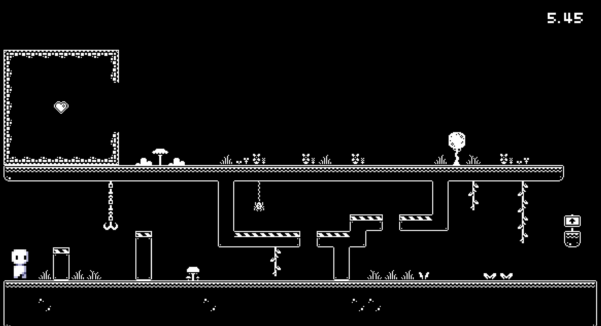

# Green Reaper #


## Summary ##

Oh no! You've just been notified that you have 20 days left in the world before the reaper takes you to the afterlife! Fortunately, you met the GREEN REAPER... They'll extend your life if you can get them $1,000,000 before your expiration date! Every 5 days, the Green Reaper will check if you're making good progress, and if not... You'll see... Money isn't that easy to make! Skillfully play and gamble your way to get $1,000,000. Just some advice, if you want any chance of getting $1,000,000 in 20 days, you have no choice but to gamble!! Best of luck on getting that money :D

## Project Resources

[Web-playable version of your game.](https://hansonklau.itch.io/green-reaper)  
[Trailer](https://www.youtube.com/watch?v=lMgy5xW_P28&ab_channel=HansonLau)  
[Press Kit](https://hansonklau.itch.io/green-reaper)  
[Proposal (Initial Plan)](https://docs.google.com/document/d/1rhZbmHajvX8lwk-x3umaan0xg93i457ZWKbK2ypXuaE/edit?usp=sharing)  

## Gameplay Explanation ##

When the player starts the game, they actually don't have to worry too much about making good progress in the first 5-10 days. Use these first 10 days to see which games you are best at. The boss phases only trigger if you aren't making good progress (good progress means 1/4 progress at each check). Luckily, the first 2 boss phases aren't too hard to survive through, and they give you enough money to catch up to the checkpoint thresholds (i.e. if you beat the first boss phase, your cash is set to $250,000 if you beat the second boss phase, your cash is set to $500,000). After day 10, you should start wagering a lot more on the games you are confident in. You want to avoid activating the third boss phase, and the fourth boss phase essentially forces you to lose since you were unable to obtain $1,000,000 by turn 20.

## Button Mappings

### Map

#### 'D' - Roll Die

#### 'Z' - Zoom out on map (toggle)

##### 'Arrow Keys' - To move around map while zoomed out

### Minigames
(Controls will vary in each minigame, please refer to the controls shown in the minigame)

#### 'A' - Move Left

#### 'D' - Move Right

#### 'Space' - Jump

#### 'K' - Kick

#### 'Mouse' - Move cursor to move player


# External Code, Ideas, and Structure #

If your project contains code that: 1) your team did not write, and 2) does not fit cleanly into a role, please document it in this section. Please include the author of the code, where to find the code, and note which scripts, folders, or other files that comprise the external contribution. Additionally, include the license for the external code that permits you to use it. You do not need to include the license for code provided by the instruction team.

If you used tutorials or other intellectual guidance to create aspects of your project, include reference to that information as well.

Exercise 1: `character.gd` and `player.gd`. Wasn't able to find a public link to the files.

Exercise 2: `push_box.gd` [(link)](https://github.com/ensemble-ai/exercise-2-camera-control-chris-phan/blob/a1563182b4b2dd4e85a30a634f01d0f591b0a238/Obscura/scripts/camera_controllers/push_box.gd#L26)

[Godot 4 — An Overview of Control Nodes | Easy UI (Tutorial)](https://www.youtube.com/watch?v=KfydpMuTBvA)

[Godot Control Node (UI) Masterclass](https://www.youtube.com/watch?v=5Hog6a0EYa0)

# Main Roles #

Your goal is to relate the work of your role and sub-role in terms of the content of the course. Please look at the role sections below for specific instructions for each role.

Below is a template for you to highlight items of your work. These provide the evidence needed for your work to be evaluated. Try to have at least four such descriptions. They will be assessed on the quality of the underlying system and how they are linked to course content. 

*Short Description* - Long description of your work item that includes how it is relevant to topics discussed in class. [link to evidence in your repository](https://github.com/dr-jam/ECS189L/edit/project-description/ProjectDocumentTemplate.md)

Here is an example:  
*Procedural Terrain* - The game's background consists of procedurally generated terrain produced with Perlin noise. The game can modify this terrain at run-time via a call to its script methods. The intent is to allow the player to modify the terrain. This system is based on the component design pattern and the procedural content generation portions of the course. [The PCG terrain generation script](https://github.com/dr-jam/CameraControlExercise/blob/513b927e87fc686fe627bf7d4ff6ff841cf34e9f/Obscura/Assets/Scripts/TerrainGenerator.cs#L6).

You should replay any **bold text** with your relevant information. Liberally use the template when necessary and appropriate.

## Minigame Lead (Christopher Phan)

We had a shared [Google Sheets](https://docs.google.com/spreadsheets/d/12mCzZi8sv8D7Ga9r-oDEVJ3HBns_-IhfT880fozEuVY/edit?usp=sharing) that had a list of minigame ideas. Many of these changed during development. Most of the minigames from this list involved using a mouse and interacting with the game through a UI instead of through controlling a character. The minigames that I implemented kept the core functionality of the minigames in the list, but I decided to make the player interact with the game through controlling a character to make the experience feel more like a game. I felt that if a lot of the games just used the mouse and didn’t have a character, it would feel like an online quiz and wouldn’t be as fun. I didn’t get the chance to implement every game in the list, but I focused on implementing the ones that I felt would be the most engaging.

### Minigame manager
The [minigame manager](https://github.com/chris-phan/ecs179-final-project/blob/b67a9534f8ce1002b99159326979195c9940da21/green_reaper/scripts/minigame_manager.gd#L1) retrieves [all the relevant data](https://github.com/chris-phan/ecs179-final-project/blob/b67a9534f8ce1002b99159326979195c9940da21/green_reaper/scripts/minigame_manager.gd#L89) from the minigame. The UI scripts [pull](https://github.com/chris-phan/ecs179-final-project/blob/b67a9534f8ce1002b99159326979195c9940da21/green_reaper/scripts/minigame_result_ui.gd#L42) relevant data from the minigame manager and [displays](https://github.com/chris-phan/ecs179-final-project/blob/b67a9534f8ce1002b99159326979195c9940da21/green_reaper/scripts/minigame_ui.gd#L71) it dynamically. The minigame manager also handles switching between the instructions and wager screen to the actual minigame and finally from the minigame to the result screen through [signals](https://github.com/chris-phan/ecs179-final-project/blob/b67a9534f8ce1002b99159326979195c9940da21/green_reaper/scripts/minigame_manager.gd#L27). All the minigames are kept in a list and [shuffled](https://github.com/chris-phan/ecs179-final-project/blob/b67a9534f8ce1002b99159326979195c9940da21/green_reaper/scripts/minigame_manager.gd#L51). Minigames are popped off the list as they’re played. When all the minigames are played, the list is recreated and shuffled again. The minigame manager relies on the minigame to contain all the relevant information necessary for the UI to display. To do this, all minigames inherit from a Minigame superclass. Then, [polymorphism](https://github.com/chris-phan/ecs179-final-project/blob/b67a9534f8ce1002b99159326979195c9940da21/green_reaper/scripts/minigame_manager.gd#L104) is used to treat all the minigames the same.

### Minigame Superclass
The [minigame superclass](https://github.com/chris-phan/ecs179-final-project/blob/b67a9534f8ce1002b99159326979195c9940da21/green_reaper/scripts/minigame.gd#L1) provides basic functionality, shared variables that are used by the minigame manager, and child nodes that must be present. Also, it provides functions that should be overridden. Some [methods are implemented](https://github.com/chris-phan/ecs179-final-project/blob/b67a9534f8ce1002b99159326979195c9940da21/green_reaper/scripts/minigame.gd#L84) and they’re used by the derived classes by invoking [super](https://github.com/chris-phan/ecs179-final-project/blob/b67a9534f8ce1002b99159326979195c9940da21/green_reaper/scripts/time_platforming_minigame.gd#L64). This is basically the bare bones of a minigame, and all minigames inherit from this class.

A minigame needs to contain the following [information](https://github.com/chris-phan/ecs179-final-project/blob/b67a9534f8ce1002b99159326979195c9940da21/green_reaper/scripts/minigame.gd#L26): a path to its scene, a name, a path to its image, instructions, tooltips for each difficulty, a list of relevant controls, and a payout multiplier. After the minigame ends, there’s a 2.5 second [timer](https://github.com/chris-phan/ecs179-final-project/blob/b67a9534f8ce1002b99159326979195c9940da21/green_reaper/scripts/minigame.gd#L39) before the results show up. This is done since we want to fully show the minigame player’s win/lose animation before switching to the result scene. Minigames also have to implement a [luck mechanic](https://github.com/chris-phan/ecs179-final-project/blob/b67a9534f8ce1002b99159326979195c9940da21/green_reaper/scripts/minigame.gd#L38) specific to its game. Players can only get [lucky once](https://github.com/chris-phan/ecs179-final-project/blob/b67a9534f8ce1002b99159326979195c9940da21/green_reaper/scripts/minigame.gd#L70) in a minigame. Luck is based on the player’s luck stat on the board. If the player has 30% luck, they have a 30% chance of being lucky in the minigame. See the individual minigames section below for a description of how luck impacts each game.

### Platforming Player
A better name for this would be minigame character since the minigames changed from being mouse oriented to all being character oriented. The character’s sprite has the following animations: fall, idle, kick, jump, land, lose, walk, and win. The jump, fall, and land animations are separated into 3 different animations to give more control over how they’re played. For example, the player doesn’t have to jump in order for the fall animation to start playing since they can walk off a ledge and start falling. Similarly, when the player transitions from the air to the ground, the land animation should play. These animations are controlled by the [animation tree’s state machine](https://github.com/chris-phan/ecs179-final-project/blob/b67a9534f8ce1002b99159326979195c9940da21/green_reaper/scripts/platforming_player.gd#L87). This was also leveraged to prevent the player from kicking while in the air. The character uses the command pattern. There’s a command for [moving left](https://github.com/chris-phan/ecs179-final-project/blob/b67a9534f8ce1002b99159326979195c9940da21/green_reaper/scripts/comands/platforming_player/platforming_player_move_left.gd#L1), [moving right](https://github.com/chris-phan/ecs179-final-project/blob/b67a9534f8ce1002b99159326979195c9940da21/green_reaper/scripts/comands/platforming_player/platforming_player_move_right.gd#L1), [jumping](https://github.com/chris-phan/ecs179-final-project/blob/b67a9534f8ce1002b99159326979195c9940da21/green_reaper/scripts/comands/platforming_player/platforming_player_jump.gd#L1), and [idling](https://github.com/chris-phan/ecs179-final-project/blob/b67a9534f8ce1002b99159326979195c9940da21/green_reaper/scripts/comands/platforming_player/platforming_player_idle.gd#L1). The majority of the player’s code is adapted from the character in the first exercise.

### Instructions and Wager UI

The instruction and wager UI uses a tab container to have an instructions and wager tab that the user can easily navigate between. This is important since our game revolves around wagering, so it’s helpful for the player to be able to go back and reread the instructions before selecting a difficulty and starting the minigame. The instructions screen has a picture of the minigame, the relevant controls, and instructions on how to play the game.


On the wager page, they can select a difficulty. If you hover over one of the difficulty buttons, it will display a tooltip that tells you what constraints are imposed by the difficulty. The buttons also change color when hovered in order to make it more obvious that they are buttons and also to subtly encourage the user to keep their mouse hovered over the button. This way, they’ll be more likely to figure out that hovering over the difficulty button shows you what to expect. The wagering is in increments of 1000. The minimum wager is 0 and the maximum is how much cash they currently have. The increase and decrease buttons can be held to increase it faster. Buttons in Godot don’t have a signal for a mouse click being held down, so the [trick](https://github.com/chris-phan/ecs179-final-project/blob/b67a9534f8ce1002b99159326979195c9940da21/green_reaper/scripts/minigame_ui.gd#L175) is to have a timer that counts down as soon as a mouse down event is triggered. When that timer goes down to 0, a [second shorter timer starts](https://github.com/chris-phan/ecs179-final-project/blob/b67a9534f8ce1002b99159326979195c9940da21/green_reaper/scripts/minigame_ui.gd#L201). Every time this second timer has a timeout, the wager will be increased and the second timer gets restarted. This repeats until a [mouse up event occurs](https://github.com/chris-phan/ecs179-final-project/blob/b67a9534f8ce1002b99159326979195c9940da21/green_reaper/scripts/minigame_ui.gd#L180). This interaction of holding down the increase or decrease button is intuitive for the user and makes it easy to quickly change their wager.

### Result UI

When the game is over, the user should be able to see the outcome. Showing everything at the same time could feel overwhelming and it also doesn’t feel as impactful. So, we have a delay between each stat which [staggers](https://github.com/chris-phan/ecs179-final-project/blob/b67a9534f8ce1002b99159326979195c9940da21/green_reaper/scripts/minigame_result_ui.gd#L94) how they’re shown.

A [tween](https://github.com/chris-phan/ecs179-final-project/blob/b67a9534f8ce1002b99159326979195c9940da21/green_reaper/scripts/minigame_result_ui.gd#L108) is used to show the players total amount of cash after the minigame. Showing the money accumulating makes the gain more impactful. And similarly, seeing the money decreasing, makes the loss more painful. When the tween finishes, [a button shows up](https://github.com/chris-phan/ecs179-final-project/blob/b67a9534f8ce1002b99159326979195c9940da21/green_reaper/scripts/minigame_result_ui.gd#L124) to exit the minigame.

Depending on the outcome, the minigame player has a [win and lose animation that plays](https://github.com/chris-phan/ecs179-final-project/blob/b67a9534f8ce1002b99159326979195c9940da21/green_reaper/scripts/minigame_result_ui.gd#L101). The character is shown after the player’s new cash is shown since we want the illusion of the character reacting to the outcome.

### Minigame Design
The intent behind wagering in minigames is to make the easy difficulties really easy and something that the player should be able to win each time. The payout for selecting easy is relatively low and the multiplier never exceeds 2. The hard difficulties are very challenging and the player isn’t expected to win each time, but the payouts are at least 3 times the original wager. We want to encourage taking risks, so the player only loses the amount they wager. In other words, the punishment for losing is the same, regardless of difficulty.

### Time Platforming
The Time Platforming games have the same [superclass](https://github.com/chris-phan/ecs179-final-project/blob/b67a9534f8ce1002b99159326979195c9940da21/green_reaper/scripts/time_platforming_minigame.gd#L1). The goal is to get to the heart sprite before the time runs out. The difficulties determine the amount of time you have. If the player runs out of time, they have a chance of being lucky. If they’re lucky, they [gain 3 additional seconds](https://github.com/chris-phan/ecs179-final-project/blob/b67a9534f8ce1002b99159326979195c9940da21/green_reaper/scripts/time_platforming_minigame.gd#L95). The payout is 1.25x for easy, 2x for medium, and 3x for hard. Since a timed platforming gaming is very general, we have many different versions that rely on the existing superclass framework. To [make a new platforming game](https://github.com/chris-phan/ecs179-final-project/blob/b67a9534f8ce1002b99159326979195c9940da21/green_reaper/scripts/time_platforming_minigame2.gd#L1), all you have to do is extend the superclass and change the image and scene paths. Then, you can define the difficulties. The original timed platforming game can be duplicated and the [camera can optionally be given a script](https://github.com/chris-phan/ecs179-final-project/blob/b67a9534f8ce1002b99159326979195c9940da21/green_reaper/scripts/pushbox_camera.gd#L1).

#### Timed Platforming Game 1

The challenge is getting up through a very narrow space. Camera is locked in place and captures the entire level.

#### Timed Platforming Game 2

The challenge is doing many consecutive jumps in a row, if you mess up and fall, you get teleported back to the start. The camera is a [push box camera](https://github.com/chris-phan/ecs179-final-project/blob/b67a9534f8ce1002b99159326979195c9940da21/green_reaper/scripts/pushbox_camera.gd#L21) adapted from Exercise 2 and specialized for this level. It also lerps back to the player when they are teleported back to the start after touching a spike. This is done to make the sudden change in the player’s position less jarring.

#### Timed Platforming Game 3

There are two different routes the player can take. The route on the left is safe but slow. The route on the right is dangerous since touching a spike will cause you to go back to the start, but it is faster. The hard difficulty requires you to choose the risky path in order to win since the safe path is too slow. The stage is about getting to the bottom. You can see the immediate floor below you. Each time you clear a floor, the [camera lerps downward](https://github.com/chris-phan/ecs179-final-project/blob/70a917b7b2f7094186c4e4d9be61be966b503ba3/green_reaper/scripts/hlock_camera.gd#L31) to show the bottom of the next floor below you. The camera also [lerps back to the player](https://github.com/chris-phan/ecs179-final-project/blob/70a917b7b2f7094186c4e4d9be61be966b503ba3/green_reaper/scripts/hlock_camera.gd#L26) if they touch a spike.

#### Timed Platforming Game 4

The challenge is performing a max distance jump. The timing on this is really tight and hard difficulty gives you 2-3 attempts. The camera is fixed in place and shows the entire level.

For the 2nd and 3rd platforming games, since they are bigger than one screen width, there are arrows showing the player where to go to beat the minigame.

### Memory

The [memory minigame](https://github.com/chris-phan/ecs179-final-project/blob/b67a9534f8ce1002b99159326979195c9940da21/green_reaper/scripts/memory_minigame.gd#L1) shows the text of a color after each round. The player has to remember the previous colors and repeat the sequence in order. The added difficulty is that the text stays on screen for less than a second. And the font color of the text might not be the same as what the text is saying. For example, the player might be shown “BLUE” with a red font color. The difficulty changes how many rounds the player has to beat. The payout is 1.5x for easy, 2x for medium, and 5x for hard. There are 7 rounds for easy, 10 rounds for medium, and 15 rounds for hard.

### Internal Timer

The [internal timer minigame](https://github.com/chris-phan/ecs179-final-project/blob/b67a9534f8ce1002b99159326979195c9940da21/green_reaper/scripts/internal_timer_minigame.gd#L1) tests the player’s ability to keep track of time in their head. There’s a timer display that counts down. It starts at 10 seconds and counts down. When it reaches 7.5 seconds, the display disappears and the user has to count in their head. They have to stop the timer as close to 0 seconds as possible. The difficulty determines how much leeway the player is given over or under 0 seconds. For example, the Easy difficulty gives you 0.75 seconds above or below 0 seconds. If you stop the timer any time in between 0.75 to -0.75 seconds, you win. If the player is lucky, the timer display doesn’t disappear, so the player can see the timer the whole time. The tolerance is 0.5 seconds for medium and 0.15 seconds for hard. We learned that 0.15 seconds is perceived as instant for humans, but since there’s 0.15 seconds of leeway on either side of 0, there’s really a 0.3 second window, which makes it a little easier. The payout is 1.25x for easy, 2x for medium, and 3x for hard.

### Observation

The [observation minigame](https://github.com/chris-phan/ecs179-final-project/blob/b67a9534f8ce1002b99159326979195c9940da21/green_reaper/scripts/observation_minigame.gd#L1) is about counting the various moving objects. The objects move around for 10 seconds and then they disappear. The player then has to answer a question about how many of a particular object they saw. Each round, a new type of object is added and the minimum number of objects increases. The question can be about any of the objects in the round, so the player has to keep track of the number of each object. The difficulty determines how many rounds there are. The maximum difficulty, hard, has 3 rounds, and medium and easy have 2 rounds and 1 round respectively. The payout is 1.5x for easy, 2.5x for medium, and 4x for hard.

## Event Lead (Arnold Zhou)

Events are handled quite similarly to minigames, but are simpler in terms of
signal logic because there is no need to switch between an instruction UI and
the actual game UI. Some of the events are simple and deterministic one-step
events, while others take multiple steps and have random outcomes. (I was also
responsible for creating the `ActionMinigame`.)

### `EventManager`

The `EventManager` is responsible for maintaining a random rotation of events,
selecting one when the player lands on an event space, and fetching the
appropriate data about that specific event. The event rotation is handled the
same as the minigame rotation, where events are popped off a list to prevent
repeat encounters and the rotation is repopulated once all events are played.
The only exception to this is the `NoobEvent`, which is immediately added back
to the rotation in a random position after it is played.

### `Event`

Like the minigames, all events inherited basic variables and functionality from
the `Event` superclass. Each event has an `event_name` which is displayed in the
event UI and an `event_body` which describes the initial scenario and changes in
response to player decisions. The event also keeps track of which step of the
encounter the player is on, which is especially useful for longer events like
the lottery event. Other information about events such as payout bounds, the
actual payout, and change in luck are stored here as well.

### `EventUI`

The `EventUI` is fairly simple. It fetches information about the body and button
text and updates the scene whenever a button is clicked. Once the maximum number
of steps is reached, the choice buttons have their visibilities toggled off and
the end event button is toggled on.

### `EventResultUI`

The `EventResultUI` displays the results of an event. The cash payout is
displayed here, but the luck difference is deliberately hidden in this UI. The
player can still figure out how their luck changed by looking at the board
afterwards, but this adds some element of suspense for the player (*did I really
just get that much money from the wizard for free?*). Also, there is no victory
or defeat animation for the player in this UI, unlike the `MinigameResultUI`.
This is because some events can have mixed results, like decreasing cash but
increasing luck.

### `ActionMinigame`

The `ActionMinigame` is based off of Simon Says. The player must survive for 20
seconds by quickly completing specific commands, like "Jump!" or "Reach the
coin!". The player is allowed to take 1 second breaks in between successful
command completions. To prevent the player from spamming actions and cheesing
the game, there is a "Don't move!" command which has a shorter reaction time
than the others. This encourages the player to stand still in between commands.

The minigame difficulty changes how much time the player has to complete each
command. On hard difficulty, the player is given 0.6 seconds. (The average human
reaction time is about 0.25 seconds, but the player also has to read the command
text and respond with the appropriate keyboard input.) Some events have
customized response times — the "Don't move!" command has a 50% shorter response
time, and the "Reach the coin!" command gives the player two extra seconds to
traverse the platform.

## Checkpoints Designer (Aditya Bhatia)
### Checkpoint Logic
[The main checkpoint logic](https://github.com/chris-phan/ecs179-final-project/blob/0d0211a24f4362d46812eb2e6589d9f21aa72009/green_reaper/scripts/minigame_manager.gd#L80) that activates the boss minigame every 5 turns is implemented in the minigame manager class. The class uses the state manager to check the number of turns that have passed and uses that number to calculate both the boss phase / level and the cutoff money below which the game has to be triggered. I make sure to clear the minigame rotation array to guarantee that only the boss minigame is called. This works well as once the boss minigame is triggered, it is popped from the array and the code checks for an empty minigame array and re adds all other minigames to it.

### Boss Minigame
The boss minigame class, like the other minigames, extends the base minigame class. Being a derived class, it implements all the expected common functions such as win, lose, get_payout, and set_difficulty. It also has all the expected fields that are needed for the UI. I will now explain all the things specific to the boss class.

### Player Movement
Unlike all other minigames, the player is no longer controlled by the keyboard and instead all standard controls are unbound and replaced with the boss specific control system. This system simply updates the player’s global position with the global position of the mouse while clamping the value to [prevent the player from being able to go off-screen](https://github.com/chris-phan/ecs179-final-project/blob/0d0211a24f4362d46812eb2e6589d9f21aa72009/green_reaper/scripts/boss_minigame.gd#L60). 

### Spawning Enemies
The spawn rate of the enemies is determined by the “difficulty” which is essentially the phase of the boss minigame. Higher phases have faster spawn rates and the [values are stored in a dictionary](https://github.com/chris-phan/ecs179-final-project/blob/0d0211a24f4362d46812eb2e6589d9f21aa72009/green_reaper/scripts/boss_minigame.gd#L7). The phase of the minigame also decides what enemy type will be spawned. The first phase spawns only the normal enemy type, while the second phase spawns both normal and hat enemies. The third phase spawns normal, hat, and horned enemies, and the last phase spawns the green reaper. The type of enemy is determined in the [_set_target_type function](https://github.com/chris-phan/ecs179-final-project/blob/0d0211a24f4362d46812eb2e6589d9f21aa72009/green_reaper/scripts/boss_minigame.gd#L134) using the current spawn rate (indirectly the phase) and is added to an array of possible enemy types each time the [_spawn_enemy function](https://github.com/chris-phan/ecs179-final-project/blob/0d0211a24f4362d46812eb2e6589d9f21aa72009/green_reaper/scripts/boss_minigame.gd#L148) is called. Spawning an enemy creates a new CheckpointEnemy object using the checkpoint_enemy packed scene and is stored in an array that is the value to a key of that enemy type in the _targets dictionary. This object receives its type in the _set_target_type function by using the object’s [set_type function](https://github.com/chris-phan/ecs179-final-project/blob/0d0211a24f4362d46812eb2e6589d9f21aa72009/green_reaper/scripts/checkpoint_enemy.gd#L73) and passing a random type from the array of possible enemy types. The checkpoint enemy object calls the [pick_rand_position function](https://github.com/chris-phan/ecs179-final-project/blob/0d0211a24f4362d46812eb2e6589d9f21aa72009/green_reaper/scripts/boss_minigame.gd#L103) from the boss minigame class to set its spawn position. The function simply picks a random point at the border of the playable screen and returns it. The enemy’s size and speed is decided randomly in the _ready function of the checkpoint enemy class.

### Collision and Damage
The CheckpointEnemy class is almost identical to the observation_target class except the movement logic. The checkpoint enemy has [different movement depending on its type](https://github.com/chris-phan/ecs179-final-project/blob/0d0211a24f4362d46812eb2e6589d9f21aa72009/green_reaper/scripts/checkpoint_enemy.gd#L48). The normal type moves straight from its spawn point to the other side of the screen. The hat type moves from its spawn point towards the direction of the player when the enemy was spawned with 10% margin, and the horned and reaper enemies move directly towards the player. The enemies are  moved using the move_and_collide function and this allows us to easily handle collision logic. The collision layer and masks of the player and enemies are set up such that the enemies can collide with the player but not amongst each other. When a collision is detected, the [_handle_collision function](https://github.com/chris-phan/ecs179-final-project/blob/0d0211a24f4362d46812eb2e6589d9f21aa72009/green_reaper/scripts/checkpoint_enemy.gd#L79) decreases the player’s cash using the state_manager by the amount based off of the enemy’s type stored in the [_DAMAGE dictionary](https://github.com/chris-phan/ecs179-final-project/blob/0d0211a24f4362d46812eb2e6589d9f21aa72009/green_reaper/scripts/checkpoint_enemy.gd#L18). It also plays a damage sound effect and then it queue frees itself. The hitbox of the enemies is a simple 16 x 16 square.

### Winning, Losing, and Payout
Like other minigames, this minigame also has a timer and its associated signals, however, here [when the timer runs out the player wins](https://github.com/chris-phan/ecs179-final-project/blob/0d0211a24f4362d46812eb2e6589d9f21aa72009/green_reaper/scripts/boss_minigame.gd#L189) as long as they have positive cash. If the player drops to 0 or less cash before the timer runs out, [they lose the minigame](https://github.com/chris-phan/ecs179-final-project/blob/0d0211a24f4362d46812eb2e6589d9f21aa72009/green_reaper/scripts/boss_minigame.gd#L74). [The player can get lucky](https://github.com/chris-phan/ecs179-final-project/blob/0d0211a24f4362d46812eb2e6589d9f21aa72009/green_reaper/scripts/boss_minigame.gd#L75) and get $20k added to their cash instead of taking damage if they are about to die. The Green Reaper / Final phase / Phase 4 is unwinnable as there is an enemy that spawns every frame. [Payout for the minigame is simple](https://github.com/chris-phan/ecs179-final-project/blob/0d0211a24f4362d46812eb2e6589d9f21aa72009/green_reaper/scripts/boss_minigame.gd#L128). If the player wins, the payout is the amount of money they were supposed to have by that checkpoint. If they lose, the payout is 0 causing them to lose the entire game.

### UI and Interaction
The UI of the boss minigame is extremely similar to that of the other minigames. The initial screen follows the exact same format except for the fact the wager tab is disabled as the minigame has pre difficulty set wager amounts (you are essentially wagering all your current balance). The game screen has the timer in the top right corner (following the other minigames) and the player’s current cash amount in the top left hand corner. This lets the player know how much “damage” they have taken and how close they are to losing. The sprites for all the enemies are visible through their idle animations. Depending on the type in the checkpoint enemy object, [the respective idle animation is picked](https://github.com/chris-phan/ecs179-final-project/blob/0d0211a24f4362d46812eb2e6589d9f21aa72009/green_reaper/scripts/checkpoint_enemy.gd#L75). This animation casts the sprite png onto the Sprite2D object. The player node is the same as used in the other minigames.


## Board Designer (Hanson Lau)

While the main objective of this role was to create the board/map that the player can navigate through, this role also included handling the player movement on the board, creating an introduction scene, tracking when the player won or lost the game, creating the lose and win scenes, and finally creating a restart functionality that resets the board and player. Compared to the initial design drawn in the [Initial Plan](https://docs.google.com/document/d/1rhZbmHajvX8lwk-x3umaan0xg93i457ZWKbK2ypXuaE/edit?usp=sharing), it did follow a circular design, but the path was much more interesting. Other than that, the logic for the different type of spaces remained the same and were implemented in the way that it was planned.

### Intro Scene

To set the story and give the player more context about the game, an [Introduction Scene](https://github.com/chris-phan/ecs179-final-project/blob/c5923a7a638568c39bc0b0fbf40e0e93a456f90e/green_reaper/scenes/intro_manager.gd#L1) would do a good job of doing that. This introduction explained that the objective is to earn one million dollars by 20 turns and that the reaper would check the player's status every 5 turns. It also explains the narrative that the player will go to the afterlife in 20 turns, but if they can give the Green Reaper $1,000,000 they can extend their life. The intro manager played with the text's [Visible Ratio](https://github.com/chris-phan/ecs179-final-project/blob/c5923a7a638568c39bc0b0fbf40e0e93a456f90e/green_reaper/scenes/intro_manager.gd#L50) to give it a typing effect when displayed. A [Skip](https://github.com/chris-phan/ecs179-final-project/blob/c5923a7a638568c39bc0b0fbf40e0e93a456f90e/green_reaper/scenes/intro_manager.gd#L82) button was added so that the player can just skip through the dialogue if they have seen it before or they just don't want to read it. The goal of the Intro scene was to ease the player into the game, so this scene is only shown once throughout the lifetime of the game (it get's queue_free()'ed and never instantiated again even after the restart button is pressed). 

### Board Art

Fortunately there was art that was free to use for the [Board Background](https://kenney-assets.itch.io/rpg-urban-kit) and it looked quite nice for our game. A lot of time was used to build this map and it felt like city planning. There wasn't really any code that was used in this portion because it was just drawing out the board. However, certain tools in Godot such as the rectangle fill tool and the ability to copy and paste chunks was very helpful in this process. Multiple TileMapLayers were utilized to make the map looked more detailed. Using multiple layers allow for the art to stack on top of each other (i.e. a window in front of a brick wall).

### Board Creation
In the [Board Creation File](https://github.com/chris-phan/ecs179-final-project/blob/c5923a7a638568c39bc0b0fbf40e0e93a456f90e/green_reaper/scripts/board.gd#L1), there were three critical functionalities:

#### - Instantiating Space Node
There are a total of 24 spaces on the board, and there are 5 different types of spaces. There are 4 [Gain Money Spaces](https://github.com/chris-phan/ecs179-final-project/blob/c5923a7a638568c39bc0b0fbf40e0e93a456f90e/green_reaper/scenes/gain_money_space.tscn#L1), 4 [Lose Money Spaces](https://github.com/chris-phan/ecs179-final-project/blob/c5923a7a638568c39bc0b0fbf40e0e93a456f90e/green_reaper/scenes/lose_money_space.tscn#L1), 4 [Gain Luck Spaces](https://github.com/chris-phan/ecs179-final-project/blob/c5923a7a638568c39bc0b0fbf40e0e93a456f90e/green_reaper/scenes/gain_luck_space.tscn#L1), 4 [Lose Luck Spaces](https://github.com/chris-phan/ecs179-final-project/blob/c5923a7a638568c39bc0b0fbf40e0e93a456f90e/green_reaper/scenes/lose_luck_space.tscn#L1), and 8 [Event Spaces](https://github.com/chris-phan/ecs179-final-project/blob/c5923a7a638568c39bc0b0fbf40e0e93a456f90e/green_reaper/scenes/event_space.tscn#L1). When instantiating each of these spaces, this [Condition](https://github.com/chris-phan/ecs179-final-project/blob/c5923a7a638568c39bc0b0fbf40e0e93a456f90e/green_reaper/scripts/board.gd#L32) is checked every time to ensure that no more than 24 spaces are created (this was mainly to help with testing when we wanted to make the board contain more spaces of a certain type i.e. a board with all lose money spaces). The scenes for each type themselves don't have logic tied to them, they were made as scenes so that they could be instantiated multiple times and so that their art can be replicated. Every time a space is instantiated (with ```.instantiate()```), the name of the node is updated to contain the type of space they are and what number space they are (1-24). After an array of 24 spaces have been created, it gets shuffled with ```.shuffle()```.

#### - Placing Space Nodes
After the array of spaces are shuffled, the board has a child node named "spaces" which will add each space as a [Child](https://github.com/chris-phan/ecs179-final-project/blob/c5923a7a638568c39bc0b0fbf40e0e93a456f90e/green_reaper/scripts/board.gd#L75). This makes the hierarchy more organized/readable so that all the spaces created is under one node called spaces. Going through the list of shuffled spaces, each space gets their x and y positions set depending on what number node they are. The benefit of placing the space nodes by code instead of by hand is that the spacing between each node can be easily modified and therefore be easily placed consistently. To describe how they are placed briefly, there are 4 rows and 6 columns, each space is evenly spaced with the exception of the space between the third and fourth column which has 2 times more spaces between them. The spaces are placed in a zig-zag pattern so the player will follow that path (will be explained later).

#### - Listening For Signals
When the board receives a [Signal](https://github.com/chris-phan/ecs179-final-project/blob/c5923a7a638568c39bc0b0fbf40e0e93a456f90e/green_reaper/scripts/board.gd#L117) that the game ends, it will properly disable the camera and hide all the labels of the board (the turns passed, cash, and luck). This sets up for the end scene that will be displayed after the game ends. If the board receives a [Signal](https://github.com/chris-phan/ecs179-final-project/blob/c5923a7a638568c39bc0b0fbf40e0e93a456f90e/green_reaper/scripts/board.gd#L119) that the game restarted, it will ```queue_free()``` the board so that it can be created again with the positions of the spaces being reset.

### Display Player State
The player has three main attributes that are stored in the [State Manager](https://github.com/chris-phan/ecs179-final-project/blob/c5923a7a638568c39bc0b0fbf40e0e93a456f90e/green_reaper/scripts/state_manager.gd#L1): turns passed, cash, and luck. The board pulls the value from the state manager and properly updates the [Labels](https://github.com/chris-phan/ecs179-final-project/blob/c5923a7a638568c39bc0b0fbf40e0e93a456f90e/green_reaper/scripts/camera_base.gd#L76) with the values.

### Camera Perspectives
There are two perspectives of the [Camera](https://github.com/chris-phan/ecs179-final-project/blob/c5923a7a638568c39bc0b0fbf40e0e93a456f90e/green_reaper/scripts/camera_base.gd#L1), the default one is a position lock camera with it being centered on the board player and following them as they move. The second perspective is zoomed out and the camera can be moved freely with the arrow keys. The zoomed out free camera is [Bounded](https://github.com/chris-phan/ecs179-final-project/blob/c5923a7a638568c39bc0b0fbf40e0e93a456f90e/green_reaper/scripts/camera_base.gd#L14) so that it won't look outside of the map. (The map was made so that the camera will not see any blank spots). One of the more difficult parts was finding out how to make the labels (that show the player state) fixed on the screen no matter what perspective the player was on. Along with setting constant vectors for the labels' set positions, I had to [Multiply](https://github.com/chris-phan/ecs179-final-project/blob/c5923a7a638568c39bc0b0fbf40e0e93a456f90e/green_reaper/scripts/camera_base.gd#L71) the vector positions by the ratio between the zoomed in and zoomed out in order for the label to stay in the same position. The [Size](https://github.com/chris-phan/ecs179-final-project/blob/c5923a7a638568c39bc0b0fbf40e0e93a456f90e/green_reaper/scripts/camera_base.gd#L64) of the label also had to be scaled too by 1.5 whenever the camera switched perspectives. A [Zoom In](https://github.com/chris-phan/ecs179-final-project/blob/c5923a7a638568c39bc0b0fbf40e0e93a456f90e/green_reaper/scripts/camera_base.gd#L81) and [Zoom Out](https://github.com/chris-phan/ecs179-final-project/blob/c5923a7a638568c39bc0b0fbf40e0e93a456f90e/green_reaper/scripts/camera_base.gd#L88) public function was made so that other scripts/nodes can utlize them. For example, when the dice is rolled, the function to zoom the camera in is called and the player will be unable to zoom out until the next turn.

### Board Movement
The player board movement logic can be found [Here](https://github.com/chris-phan/ecs179-final-project/blob/c5923a7a638568c39bc0b0fbf40e0e93a456f90e/green_reaper/scripts/board_movement.gd#L1). First, inorder for the player to move, the player must role a [Die](https://github.com/chris-phan/ecs179-final-project/blob/c5923a7a638568c39bc0b0fbf40e0e93a456f90e/green_reaper/scripts/dice.gd#L1) to determine how many spaces they will move. In the dice script, it takes care of showing the dice, moving it next to the player, and animating the die to look like it rolled the number it randomly generated. The speed at which the die is "rolled" and the duration of how long the die shows what it rolled can be easily configured as an export parameter. Each time the player rolls the dice, the state manager will increment the number of turns passed by 1. The most critical part of the script is iterating through the spaces that were created and shuffled (from the previous section) and populating two arrays that keeps track of each spaces' position on the board, and their type. As this [Logic](https://github.com/chris-phan/ecs179-final-project/blob/c5923a7a638568c39bc0b0fbf40e0e93a456f90e/green_reaper/scripts/board_movement.gd#L71) shows, once the dice animation is finished, the player will keep moving until the number of moves it needs to make is 0. Specifically, the player will update it's 'x' position first to match the space's 'x' position, and then it will do the same for the 'y' position (this means the player will not do any diagonal movement). Finally, once the player lands on a space it will [Emit](https://github.com/chris-phan/ecs179-final-project/blob/c5923a7a638568c39bc0b0fbf40e0e93a456f90e/green_reaper/scripts/board_movement.gd#L114) a signal that contains the type of space the player landed on

### Space Handler
[Space Handler](https://github.com/chris-phan/ecs179-final-project/blob/c5923a7a638568c39bc0b0fbf40e0e93a456f90e/green_reaper/scripts/board_movement.gd#L114) takes care modifying the player state and board animations depending on what space the player landed on. The first thing it will do after determining what space the player landed on is to play an animation corresponding to the space. For example, landing on a gain luck space will show green four [leaf clovers](https://github.com/chris-phan/ecs179-final-project/blob/c5923a7a638568c39bc0b0fbf40e0e93a456f90e/green_reaper/assets/BoardPack/luck_sprite_sheet.png). The space handler is in a way an implmentation of the **Pub/Sub** pattern: the publisher would be the player signaling what type of space they landed on and the subscriber(s) would include nodes such as the minigame manager and the event manager. If the player landed on an event space, it would signal to the event manager to start the event scene. Similarily, after the board plays the corresponding animations, it will signal to the minigame manager to start the minigame scene. Lastly, the space handler will take care of updating the player state values depending on which type of space the player lands on. As an example, the player's [Cash](https://github.com/chris-phan/ecs179-final-project/blob/c5923a7a638568c39bc0b0fbf40e0e93a456f90e/green_reaper/scripts/space_handler.gd#L115) is increased here when the player lands on the gain money space. 

### End Scene


Like the Intro Scene, the [End](https://github.com/chris-phan/ecs179-final-project/blob/c5923a7a638568c39bc0b0fbf40e0e93a456f90e/green_reaper/scripts/end_manager.gd#L1) Scene completes the narrative by either showing the player being taken to the afterlife if they fail to earn $1,000,000 or the player walking away from the board if they are able to earn at least $1,000,000. One of the tricky parts of making the end scene was handling the different ways the player can bring the game into an end state. Ultimately, the player can end the game after landing on a space and after completeing a minigame. Another detail to note is that the end scene will not immediately trigger after the player win/loses a minigame, it will have to wait until after the [Minigame Exits](https://github.com/chris-phan/ecs179-final-project/blob/c5923a7a638568c39bc0b0fbf40e0e93a456f90e/green_reaper/scripts/end_manager.gd#L23). Waiting for animations and previous sections to end first makes the game feel more cohesive (if the end scene abruptly came up after minigame ended then it woul feel choppy). In addition to finding the triggers for an end game, making the [Restart](https://github.com/chris-phan/ecs179-final-project/blob/c5923a7a638568c39bc0b0fbf40e0e93a456f90e/green_reaper/scripts/end_manager.gd#L11) was also harder than it seemed. The [Main](https://github.com/chris-phan/ecs179-final-project/blob/c5923a7a638568c39bc0b0fbf40e0e93a456f90e/green_reaper/scripts/main.gd#L36) script had to listen for a reset game signal and properly create a new board as well as linking a new minigame manager and event manager to it. The player states are also reset to be what it is initially upon a restart.

# Sub-Roles

## Audio (Christopher Phan)
The main source of audio comes from the [SFXPlayer class](https://github.com/chris-phan/ecs179-final-project/blob/b67a9534f8ce1002b99159326979195c9940da21/green_reaper/scripts/sfx_player.gd#L1). This is a singleton and is autoloaded. It contains sounds for game actions and the background music. Each sound is attached to an AudioStreamPlayer2D and has its volume tuned to work well with all the other sounds. Each sound is also added to a bus. There’s a separate sound effect and background music bus. This makes it easy to adjust the volume for all the sounds.

### Sound effects
Some sounds aren’t played through the SFXPlayer since it was easier to time the sound with an animation inside an AnimationPlayer. The PlatformingPlayer’s kick and land sound are played through an AnimationPlayer.

**Attributions**:
- [Kick sound](https://pixabay.com/sound-effects/soccer-ball-kick-37625/)
- [Land sound](https://pixabay.com/sound-effects/jump-landing-30946/)
- [License](https://pixabay.com/service/license-summary/)

Background music tracks are imported to allow looping, so they automatically repeat whenever they end.

### The following sounds use the SFXPlayer:
#### PlatformingPlayer’s Walk Sound
Called by the minigame player’s move left and right commands when they’re executed.

**Attributions**:
- [Walk sound](https://pixabay.com/sound-effects/walking-snow-31224/)
- [License](https://pixabay.com/service/license-summary/)

#### Button Click Sound
Plays for all the button clicks in the game.

**Attributions**:
- [Button Click](https://pixabay.com/sound-effects/button-press-40018/)
- [License](https://pixabay.com/service/license-summary/)

#### Number Increase and Decrease Sound
Since it plays for each increase and decrease, if there were only one AudioStreamPlayer2D and were played multiple times in quick succession, it would try to repeat the first few milliseconds of the sound. To get around this, a new [AudioSteamPlayer2D is dynamically created](https://github.com/chris-phan/ecs179-final-project/blob/b67a9534f8ce1002b99159326979195c9940da21/green_reaper/scripts/sfx_player.gd#L47) each time the sound is played. Then, this is added to the scene and is [removed](https://github.com/chris-phan/ecs179-final-project/blob/b67a9534f8ce1002b99159326979195c9940da21/green_reaper/scripts/sfx_player.gd#L50) using `queue_free` after the sound is done playing. The actual sound is a page flip, and is trimmed to only include a small part of the flip.

**Attributions**:
- [Number Increase/Decrease Sound](https://pixabay.com/sound-effects/book-page-flip-28603/)
- [License](https://pixabay.com/service/license-summary/)

#### Dice Roll Sound
The same trick is used for the [dice roll sound](https://github.com/chris-phan/ecs179-final-project/blob/b67a9534f8ce1002b99159326979195c9940da21/green_reaper/scripts/sfx_player.gd#L138) to handle quickly playing consecutive sounds. The sound is taken from a cork pop, and is trimmed to only include a small part of the pop.

**Attributions**:
- [Dice Roll](https://pixabay.com/sound-effects/cork-pop-35952/)
- [License](https://pixabay.com/service/license-summary/)

#### Countdown Sound
There are 2 sounds that are extracted from the original audio file, which contains many different countdown sounds. The first sound is for the countdown from 3 to 1. The second sound is a higher pitch and is used for the final “GO”.

**Attributions**:
- [Countdown](https://pixabay.com/sound-effects/countdown-beep-104007/)
- [License](https://pixabay.com/service/license-summary/)

#### Show Result
This uses a trimmed camera shutter sound and plays in a minigame result or event result screen.

**Attributions**:
- [Show Result](https://pixabay.com/sound-effects/film-camera-shutter-1-sec-272601/)
- [License](https://pixabay.com/service/license-summary/)

#### Heartbeat
This sound plays during the internal timer minigame after the timer is hidden from the player. Where in the audio file the sound starts playing and the `pitch_scale` is [randomized](https://github.com/chris-phan/ecs179-final-project/blob/b67a9534f8ce1002b99159326979195c9940da21/green_reaper/scripts/sfx_player.gd#L69) in order to make it harder to use the heartbeats as an audio cue for the internal timer game. This sound also starts playing in the timed platforming games when there are less than 3 seconds left.

**Attributions**:
- [Heartbeat](https://pixabay.com/sound-effects/heartbeat-02-225103/)
- [License](https://pixabay.com/service/license-summary/)

#### Correct Observation
Used in the observation minigame to signify that the answer was correct. Also used in the memory game to signify the next round.

**Attributions**:
- [Correct Observation](https://pixabay.com/sound-effects/training-program-correct1-105916/)
- [License](https://pixabay.com/service/license-summary/)

#### Correct Memory
Used in memory minigame to signify that the correct color in the sequence was picked. Edited and taken from an audio file with lots of menu select sounds.

**Attributions**:
- [Correct Memory](https://pixabay.com/sound-effects/menu-select-button-182476/)
- [License](https://pixabay.com/service/license-summary/)

#### Lucky
Plays in all the minigames when the player is lucky.

**Attributions**:
- [Lucky](https://pixabay.com/sound-effects/retro-coin-1-236677/)
- [License](https://pixabay.com/service/license-summary/)


#### Board Positive
Plays on the board whenever the player gets money or luck from landing on a space.

**Attributions**:
- [Board Positive](https://pixabay.com/sound-effects/arcade-ui-18-229517/)
- [License](https://pixabay.com/service/license-summary/)

#### Board Negative
Plays on the board whenever the player loses money or luck from landing on a space.

**Attributions**:
- [Board Negative](https://pixabay.com/sound-effects/classic-game-action-negative-3-224421/)
- [License](https://pixabay.com/service/license-summary/)

#### Board Move:
Plays on the board whenever the player goes past or lands on a space.

**Attributions**:
- [Board Move](https://pixabay.com/sound-effects/pop-268648/)
- [License](https://pixabay.com/service/license-summary/)

### Background Music:
There are 4 different tracks for the board. Depending on how much cash the player currently has, the background music changes. The first track is gloomy and depressing and then they progressively become more happy. This is done with respect to the narrative since the player is getting closer to escaping the Green Reaper and getting a second chance at life. The changes in music also align with the checkpoints’ cash thresholds.

All the background music tracks come from Youtube Audio Library. The license states:
<blockquote>
You can use this audio track in any of your videos, including videos that you monetize. No attribution is required.
<br><br>
YouTube may credit the artist and link the Audio Library from your video.
<br><br>
You may not make available, distribute or perform the music files from this library separately from videos and other content into which you have incorporated these music files (e.g., standalone distribution of these files is not permitted).
</blockquote>

### Board Tracks
#### Orbit - Corbyn Kites
Plays when the player has less than 250,000 points.

**Attribution**:
[Orbit](https://www.youtube.com/watch?v=eX4AB8P0BfQ)


#### Called Upon - Silent Partner
Plays when the player has between 250,000 to 499,999 points.

**Attribution**: [Called Upon](https://www.youtube.com/watch?v=viRJOYHF7b4)


#### Icelandic Arpeggios - DivKid
Plays when the player has between 500,000 to 749,999 points.

**Attribution**: [Icelandic Arpeggios](https://www.youtube.com/watch?v=pxoq8jEGbBo)


#### Clean Living - Everet Almond
Plays when the player has 750,000 points or more.

**Attribution**: [Clean Living](https://www.youtube.com/watch?v=ZkTDCOmT-qw)

### Events
When the player enters an event, the background music from the board continues playing since they’re still considered to be on the board. Once they go into a minigame, the music changes to convey a transition.

### Minigame Tracks
In the narrative, the minigames take place in the Green Reaper’s special dimension where everything is in black and white. I wanted it to feel peaceful and calm to not distract the player. I also thought that it would be interesting to juxtapose the intensity of wagering cash which is essentially the equivalent of your in-game life on difficult minigames while a chill song is playing in the background as if this happens all the time. All the minigames use the same track. When the minigame ends, depending on the outcome, a track is selected. If the player wins, a happy song is played, and if the player loses, a sad song is played. This carries into the result screen to make the transition feel seamless.

#### Sunday Drive - Silent Partner
Plays during all minigames.

**Attribution**: [Sunday Drive](https://www.youtube.com/watch?v=T8Ay7Xz0mEQ)


#### Every Step - Silent Partner
Plays when the player loses the minigame.

**Attribution**: [Every Step](https://www.youtube.com/watch?v=_WfmldfpkKE)


#### Shadowing - Corbyn Kites
Plays when the player wins the minigame.

**Attribution**: [Shadowing](https://www.youtube.com/watch?v=aqsIy0YRZXA)


## Gameplay Testing (Aditya Bhatia)
The filled out forms [can be found here](https://github.com/chris-phan/ecs179-final-project/tree/df3f43022e3c2ef02b92124a8cfe991e00ad1ed3/gameplay%20testing%20feedback).

Overall, the play testers seemed to enjoy the minigames and felt decently challenged by them. A lot of these tests were conducted before the completion of things such as the intro cutscene, sound effects, proper keybinds, and for the first 6, the board was not complete yet. As we were completing these features, we took the feedback in mind and made it so that controls are displayed on a per minigame basis, movement being disabled while kicking, and updating some of the instructions.

The players were a bit conflicted regarding the kicking mechanic. Some people found it satisfying and were happy that the controls were consistent throughout the game. While some people didn’t like the kick to interact concept and may have preferred some other method of interaction.

Through feedback and observing the testers, it is quite clear that the memory sequence minigame is definitely not our strongest point. Specifically, there was repeated feedback of the tester not understanding what was supposed to be done in the minigame without me having to explain it quite a bit. Taking this into account, we updated the instructions for the game, however it still was not enough. But I noticed that while it may be an instructions issue, it was also noticeable from observing the testers and some of their feedback that they are not reading or paying full attention to the instructions. This is obviously fair. Gamers want to play the game, not sit and read. However, the design of the minigame is such that we would like them to read and understand the instructions before starting. A potential fix we debated would be to make the instructions yellow and thus move the player’s attention towards it (The whole yellow paint on ladders and ledges debate rears its ugly head here).

Another common feedback point was related to the difficulty of the time platforming minigame. There is one version of that minigame that has an unforgiving cutout that requires the player to be perfectly lined up under it to jump through it. This also led to the complaints about the twitchy physics. After speaking to the minigame designer, we decided that we will not change this as it is tied to the identity of that level. The challenge is that one particular jump. Instead we decided that there will be multiple platforming levels and each would have their individual challenge.

We also received some feedback about labelling the colors in the memory sequence minigame and I appreciate receiving this feedback as it is a valuable accessibility feature to have and thus will be implemented.


## Press Kit and Trailer (Hanson Lau)

The [Presskit](https://hansonklau.itch.io/green-reaper) contains the web-playable version of the game as well.

To showcase the team's work, I made sure to include a screenshot every element that each of us worked on. Namely, that included the board, the minigames, the events, and the boss fights / checkpoints. I tried to use screenshots that looked very different than each other to make the game seem bigger or fuller. Within the presskit, I added a quick game summary to give the player some context. The summary is very close to what the intro scene is in the game. Below the summary is a link to the trailer I made. Itch.io has trouble loading youtube videos for Godot 4 projects since Godot 4 requires "SharedArrayBuffer" support, so I inlcuded the link to the trailer video as well in presskit. The controls to the game are listed, and since the minigame controls vary by minigame, all the possible controls were listed. The template that Itch.io provided for the presskit was really helpful since it made the styling very easy. I made a cover [Art](https://github.com/chris-phan/ecs179-final-project/blob/f3ee9ab4c974f706871c05baca58571c1b6f7b04/green_reaper/assets/GreenReaperCover.png) for the game and uploaded that to the page. The heading fonts were modified to match the pixelated vibe of the game. The team and roles were mentioned as well. Lastly, a table of all the resources we used was added in order to give the proper credit to the artists we borrowed from.

The [Trailer](https://www.youtube.com/watch?v=lMgy5xW_P28&ab_channel=HansonLau) has been uploaded to my personal youtube channel.

Just like the presskit, instead of screenshots I made sure to include footage of every element that each of us worked on. I wanted to show small snippets of each part of the game. The snippets had to be long enough for the audience to know what is going on, but short enough for them to be curious about playing the game itself. As for the footage chosen, I only kept the most exciting parts or the parts with the most action so that it felt more engaging. Particulary for our game, there is a mix of a very colorful board and a black and white minigame interface; because of that, I did my best to mix around the footage that was mainly black and white with footage that had the colorful board. Lastly, each segment of the trailer is a compilation of a certain part of the game. For example, there can be a segment with just rolling the die which shows a lot of the board, and then there can be a segment with just minigame gameplay which shows the core of the game. The music used in the trailer was provided by Clipchamp and it is royalty free:

[Summer Splash](https://clipchamp.com/content/cc_ae8b83496-Summer-Splash-60/)

[Disturbia](https://clipchamp.com/content/cc_acb79aacd-Disturbia/)

I used Clipchamp to put together the trailer. There was plently of tools to use for me to make a decent trailer, I took advantage of the effects they provided such as the flash and pulse effect for the countdown as well as the fade in and out effect for the sounds and the end of the video. It also allowed me to add text which was really important for me to add narration to the trailer.

## Game Feel and Polish (Arnold Zhou)

For game polish, I decided to shorten the tween time when the payout was 0 so
the player didn't feel like they were waiting for nothing. This was particularly
important for the events, because many of them have an option to leave and so
the player's cash would not change. I also scaled the wage increment with the
player's current balance. Instead of having a fixed wage increment of 1000, the
wage increment increases by 1000 every time the player hits a new cash
checkpoint (250000, 500000, 750000). This way, players in later stages of the
game don't have to hold the increment button for long periods of time to bet
lots of money.